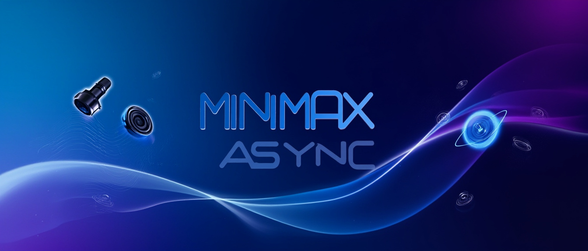
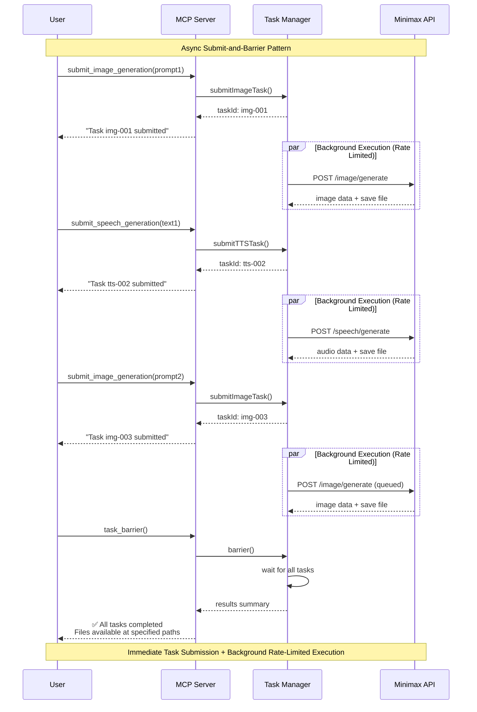

# Minimax MCP Tools



A Model Context Protocol (MCP) server for Minimax AI integration, providing async image generation and text-to-speech with advanced rate limiting and error handling.

English | [简体中文](README.zh-CN.md)

### MCP Configuration
Add to your MCP settings:
```json
{
  "mcpServers": {
    "minimax-mcp-tools": {
      "command": "npx",
      "args": ["minimax-mcp-tools"],
      "env": {
        "MINIMAX_API_KEY": "your_api_key_here"
      }
    }
  }
}
```

## Async Design - Perfect for Content Production at Scale

This MCP server uses an **asynchronous submit-and-barrier pattern** designed for **batch content creation**:

🎬 **Narrated Slideshow Production** - Generate dozens of slide images and corresponding narration in parallel  
📚 **AI-Driven Audiobook Creation** - Produce chapters with multiple voice characters simultaneously  
🖼️ **Website Asset Generation** - Create consistent visual content and audio elements for web projects  
🎯 **Multimedia Content Pipelines** - Perfect for LLM-driven content workflows requiring both visuals and audio

### Architecture Benefits:
1. **Submit Phase**: Tools return immediately with task IDs, tasks execute in background
2. **Smart Rate Limiting**: Adaptive rate limiting (10 RPM images, 20 RPM speech) with burst capacity 
3. **Barrier Synchronization**: `task_barrier` waits for all tasks and returns comprehensive results
4. **Batch Optimization**: Submit multiple tasks to saturate rate limits, then barrier once for maximum throughput


## Tools

### `submit_image_generation`
**Submit Image Generation Task** - Generate images asynchronously. 

**Required:** `prompt`, `outputFile`  
**Optional:** `aspectRatio`, `customSize`, `seed`, `subjectReference`, `style`

### `submit_speech_generation`
**Submit Speech Generation Task** - Convert text to speech asynchronously.

**Required:** `text`, `outputFile`  
**Optional:** `highQuality`, `voiceId`, `speed`, `volume`, `pitch`, `emotion`, `format`, `sampleRate`, `bitrate`, `languageBoost`, `intensity`, `timbre`, `sound_effects`

### `task_barrier`
**Wait for Task Completion** - Wait for ALL submitted tasks to complete and retrieve results. Essential for batch processing.

## Architecture


## License
MIT