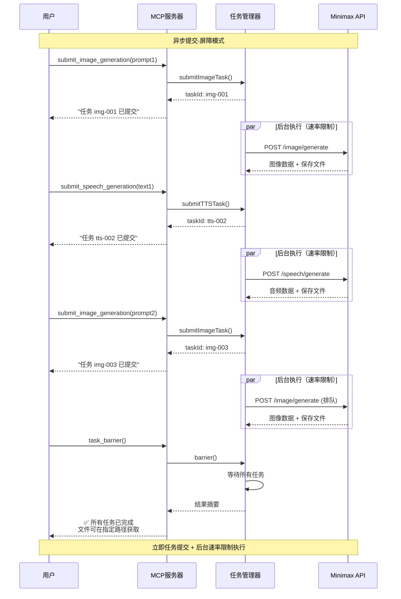

# Minimax MCP 工具


Minimax AI 集成的模型上下文协议(MCP)服务器，提供异步图像生成和文本转语音功能，具备高级速率限制和错误处理。

[English](README.md) | 简体中文

### MCP 配置
添加到你的 MCP 设置中：
```json
{
  "mcpServers": {
    "minimax-mcp-tools": {
      "command": "npx",
      "args": ["minimax-mcp-tools"],
      "env": {
        "MINIMAX_API_KEY": "your_api_key_here"
      }
    }
  }
}
```

## 异步设计 - 专为大规模内容制作而生

此MCP服务器采用**异步提交-屏障模式**，专为**批量内容创作**而设计：

🎬 **配音幻灯片制作** - 并行生成数十张幻灯片图像和对应的配音内容  
📚 **AI驱动的有声书制作** - 同时生成多个章节，支持不同音色的角色配音  
🖼️ **网站素材批量生成** - 为网页项目创建统一风格的视觉和音频元素  
🎯 **多媒体内容流水线** - 完美适配需要图文音并茂的LLM驱动内容工作流

### 架构优势：
1. **提交阶段**：工具立即返回任务ID，任务在后台执行
2. **智能限速**：自适应速率限制（图像10 RPM，语音20 RPM）支持突发容量
3. **屏障同步**：`task_barrier`等待所有任务并返回综合结果
4. **批量优化**：提交多个任务以饱和速率限制，然后一次屏障获得最大吞吐量

## 架构


## 工具

### `submit_image_generation`
**提交图像生成任务** - 异步生成图像。

**必需参数：** `prompt`, `outputFile`  
**可选参数：** `aspectRatio`, `customSize`, `seed`, `subjectReference`, `style`

### `submit_speech_generation`
**提交语音生成任务** - 异步文本转语音。

**必需参数：** `text`, `outputFile`  
**可选参数：** `highQuality`, `voiceId`, `speed`, `volume`, `pitch`, `emotion`, `format`, `sampleRate`, `bitrate`, `languageBoost`, `intensity`, `timbre`, `sound_effects`

### `task_barrier`
**等待任务完成** - 等待所有已提交的任务完成并检索结果。对于批处理至关重要。

## 许可证
MIT