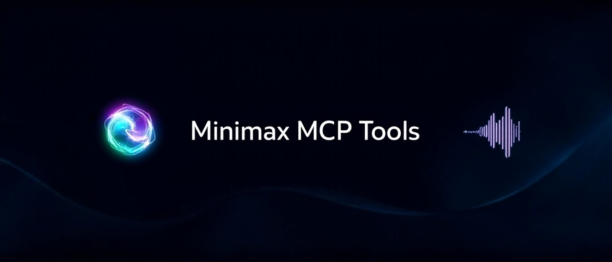

# Minimax MCP 工具



一个集成了Minimax API的模型上下文协议(MCP)服务器实现，提供AI驱动的图像生成和文本转语音功能。

[English](README.md) | 简体中文

## 功能特点

- **图像生成**：使用Minimax的image-01模型，根据文本提示生成高质量图像
- **文本转语音(TTS)**：将文本转换为自然流畅的语音，支持多种声音选项、情感和音频格式

## 设置

### 前提条件

- Node.js 16或更高版本
- Minimax API密钥（从[Minimax平台](https://api.minimax.chat/)获取）
- 用于TTS功能的Minimax Group ID

### 配置

创建或更新您的MCP配置文件：

```json
{
  "mcpServers": {
    "minimax-mcp-tools": {
      "command": "npx",
      "args": [
        "minimax-mcp-tools"
      ],
      "env": {
        "MINIMAX_API_KEY": "your-minimax-api-key",
        "MINIMAX_GROUP_ID": "your-minimax-group-id"
      }
    }
  }
}
```

## MCP接口

### 图像生成

根据文本提示生成图像：

```javascript
// 图像生成参数示例
{
  "prompt": "日落时分的山景",
  "aspectRatio": "16:9",
  "n": 1,
  "outputFile": "/absolute/path/to/image.jpg",
  "subjectReference": "/path/to/reference.jpg" // 可选：本地文件或URL
}
```

参数：
- `prompt`（必需）：要生成的图像描述
- `outputFile`（必需）：保存生成图像文件的绝对路径。**目录必须已存在**。当生成多张图像(n>1)时，文件将以序号命名（例如，'image-1.jpg'，'image-2.jpg'）。
- `aspectRatio`（可选）：图像的宽高比（默认："1:1"，选项："1:1"，"16:9"，"4:3"，"3:2"，"2:3"，"3:4"，"9:16"，"21:9"）
- `n`（可选）：要生成的图像数量（默认：1，范围：1-9）。当n>1时，输出文件名将自动编号。
- `subjectReference`（可选）：本地图像文件路径或公共URL，用作角色参考。提供后，生成的图像将使用此作为角色外观参考。支持的格式：JPG，JPEG，PNG

### 文本转语音

将文本转换为语音，支持多种自定义选项：

```javascript
// 文本转语音参数示例
{
  "text": "你好，这是文本转语音功能的测试。",
  "model": "speech-02-hd",
  "voiceId": "female-shaonv",
  "speed": 1.0,
  "volume": 1.0,
  "pitch": 0,
  "emotion": "happy",
  "format": "mp3",
  "outputFile": "/absolute/path/to/audio.mp3",
  "subtitleEnable": true
}
```

#### 基本参数：
- `text`（必需）：要转换为语音的文本（最多10,000个字符）
- `outputFile`（必需）：保存生成音频文件的绝对路径
- `model`（可选）：要使用的模型版本（默认："speech-02-hd"，选项："speech-02-hd"，"speech-02-turbo"）
  - `speech-02-hd`：高清模型，具有出色的音色相似度、节奏稳定性和录音室级音频质量
  - `speech-02-turbo`：快速模型，性能出色且延迟低，增强的多语言能力
- `voiceId`（可选）：要使用的声音ID（默认："male-qn-qingse"）
- `speed`（可选）：语音速度（默认：1.0，范围：0.5-2.0）
- `volume`（可选）：语音音量（默认：1.0，范围：0.1-10.0）
- `pitch`（可选）：语音音调（默认：0，范围：-12到12）
- `emotion`（可选）：语音情感（默认："neutral"，选项："happy"，"sad"，"angry"，"fearful"，"disgusted"，"surprised"，"neutral"）
- `timberWeights`（可选）：声音混合设置，允许混合最多4种不同的声音及其权重
  ```javascript
  "timberWeights": [
    { "voice_id": "male-qn-qingse", "weight": 70 },
    { "voice_id": "female-shaonv", "weight": 30 }
  ]
  ```

#### 音频设置：
- `format`（可选）：音频格式（默认："mp3"，选项："mp3"，"pcm"，"flac"，"wav"）
- `sampleRate`（可选）：采样率，单位Hz（默认：32000，选项：8000，16000，22050，24000，32000，44100）
- `bitrate`（可选）：MP3格式的比特率（默认：128000，选项：32000，64000，128000，256000）
- `channel`（可选）：音频通道数（默认：1，选项：1=单声道，2=立体声）

#### 高级功能：
- `latexRead`（可选）：是否读取LaTeX公式（默认：false）
- `pronunciationDict`（可选）：发音替换列表
  ```javascript
  "pronunciationDict": ["处理/(chu3)(li3)", "危险/dangerous"]
  ```
- `stream`（可选）：是否使用流式模式（默认：false）
- `languageBoost`（可选）：增强特定语言的识别
  - 选项："Chinese"，"Chinese,Yue"，"English"，"Arabic"，"Russian"，"Spanish"，"French"，"Portuguese"，"German"，"Turkish"，"Dutch"，"Ukrainian"，"Vietnamese"，"Indonesian"，"Japanese"，"Italian"，"Korean"，"Thai"，"Polish"，"Romanian"，"Greek"，"Czech"，"Finnish"，"Hindi"，"auto"
- `subtitleEnable`（可选）：是否启用字幕生成（默认：false）

## 许可证

MIT

## 贡献

欢迎贡献！请随时提交Pull Request。

## 致谢

- 感谢[Minimax API](https://platform.minimaxi.com/)提供AI模型
- 感谢[Model Context Protocol](https://github.com/modelcontextprotocol/)提供MCP规范
